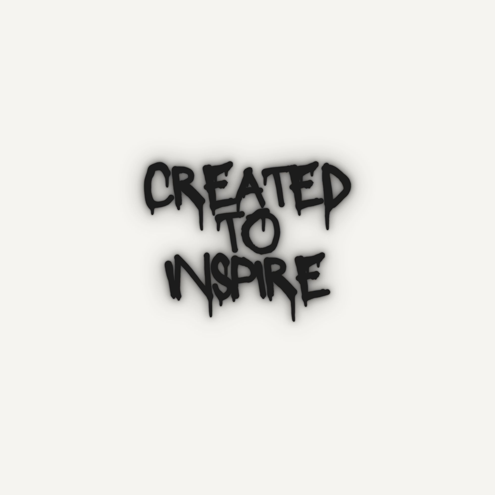

# AuraMesh AR

  

> Neon-infused AR playground with gesture-driven visuals, canvas rendering, and a backend service mesh.

---

## ✨ Snapshot

**AuraMesh AR** is a side-project rewrite of a single-file AR demo into a modular, structured experience.
It combines browser MediaPipe hand tracking, canvas-driven effects, and a lightweight Node.js service mesh.

**What it does:**
- modular frontend split into rendering, gesture logic, audio, UI, effects, and state
- gateway-backed microservices for session, gesture, effects, analytics, and profiles
- realtime WebSocket event stream for instant AR feedback

---

## � Live demo

[Open AuraMesh AR on Render](https://auramesh-gateway.onrender.com/)

---

## �🚀 Highlights

- **Gesture-driven AR** with MediaPipe hand tracking and pinch detection
- **Realtime event bus** through gateway WebSocket fan-out
- **Adaptive render mode** for lower-power devices and smoother runtime
- **Safer media startup** with camera/audio error handling and cleanup
- **Clean service boundaries** across frontend and backend responsibilities
- **Analytics-aware** event tracing and metrics capture
- **Visual effects pipeline** for theme resolution, particles, and overlays

---

## 🧩 Architecture

| Layer | Purpose | Notes |
| --- | --- | --- |
| `gateway` | API router + WS broker | public frontend entrypoint, event fan-out |
| `session-service` | session lifecycle | keeps session state isolated |
| `gesture-service` | gesture ingest | validates and forwards gesture events |
| `effects-service` | theme resolver | decides AR effect behavior |
| `analytics-service` | telemetry | captures structured event metrics |
| `profile-service` | personalization | user theme preferences |

---

## 🎨 Frontend stack

- `frontend/index.html`, `css/styles.css`
- modular JS in `frontend/js/`
- MediaPipe integration in `mediapipe.js`
- canvas renderer in `renderer.js`
- dedicated audio, UI, effects, gesture, and API layers

---

## 🛠 Tech stack

- **Browser**: vanilla HTML/CSS/JavaScript
- **AR**: MediaPipe Hands + live webcam gestures
- **Backend**: Node.js microservices, REST endpoints
- **Realtime**: WebSocket gateway push stream
- **Containers**: Docker-friendly service layout

---

## 📁 Project layout

- `frontend/`: AR UI, runtime, MediaPipe glue
- `services/`: gateway + backend microservices
- `shared/`: shared helpers and transport utilities

---

### Why this feels cool

A playful AR experiment with clean architecture: gesture-led visuals, realtime data flow, and service-oriented wiring.

